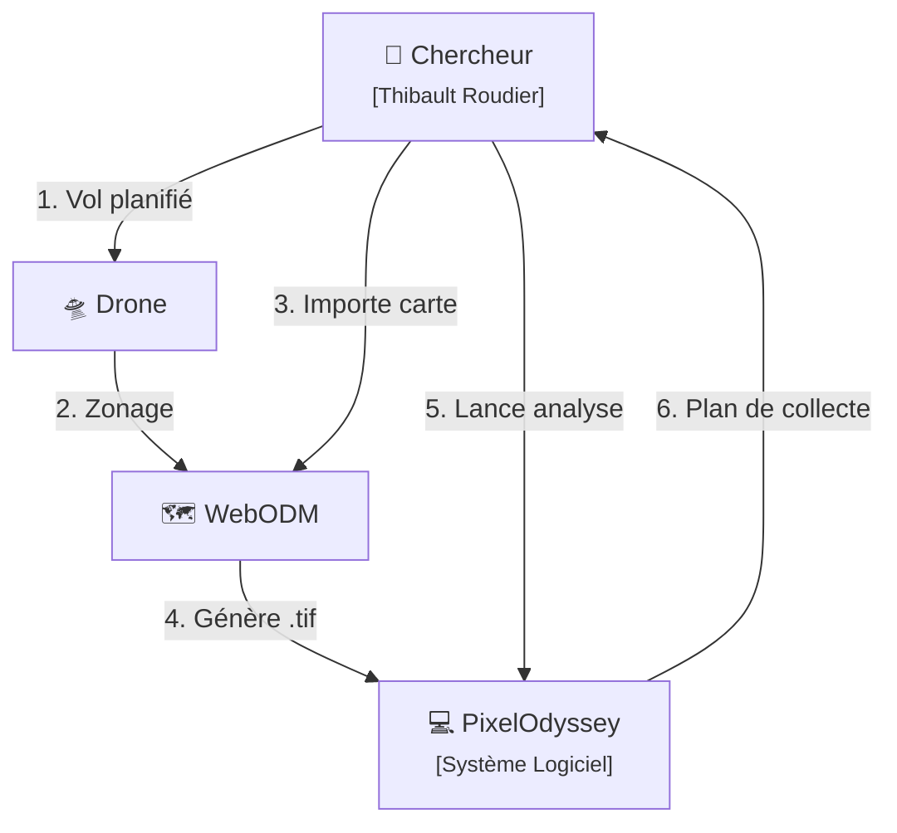
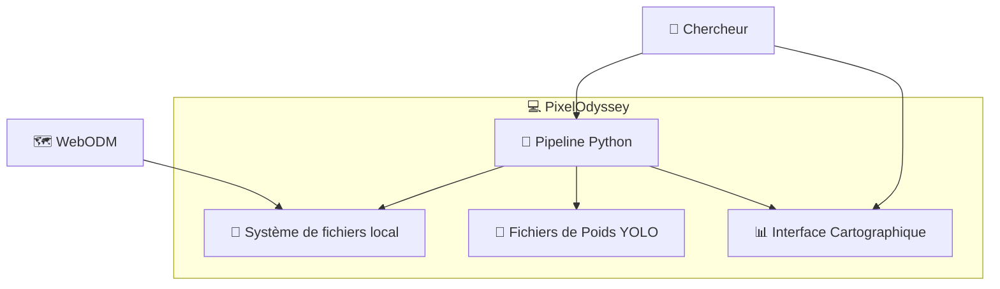
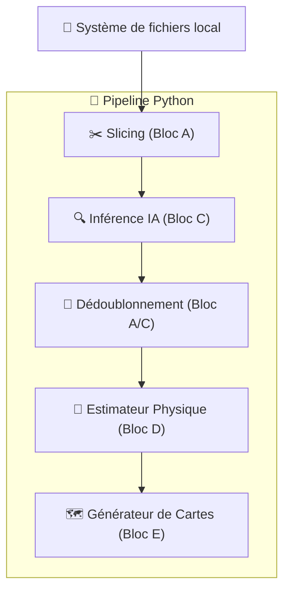

# 💻 Architecture C4 — PixelOdyssey

## Niveau 1 : Contexte

```mermaid
graph TB
    User["👤 Chercheur<br><small>[Thibault Roudier]</small>"]
    Drones["🛸 Drone"]
    WebODM["🗺️ WebODM"]
    PixelOdyssey["💻 PixelOdyssey<br><small>[Système Logiciel]</small>"]
    
    User -->|1. Vol planifié| Drones
    Drones -->|2. Zonage| WebODM
    User -->|3. Importe carte| WebODM
    WebODM -->|4. Génère .tif| PixelOdyssey
    User -->|5. Lance analyse| PixelOdyssey
    PixelOdyssey -->|6. Plan de collecte| User
```

## Niveau 2 : Conteneurs

```mermaid
graph TB
    User["👤 Chercheur"]
    WebODM["🗺️ WebODM"]
    
    subgraph PixelOdyssey ["💻 PixelOdyssey"]
        Storage["💾 Système de fichiers local"]
        Pipeline["🐍 Pipeline Python"]
        YoloWeights["🧠 Fichiers de Poids YOLO"]
        MapViewer["📊 Interface Cartographique"]
    end
    
    WebODM --> Storage
    User --> Pipeline
    Pipeline --> Storage
    Pipeline --> YoloWeights
    Pipeline --> MapViewer
    User --> MapViewer
```

## Niveau 3 : Composants

```mermaid
graph TB
    Storage["💾 Système de fichiers local"]
    
    subgraph Pipeline ["🐍 Pipeline Python"]
        Slicer["✂️ Slicing (Bloc A)"]
        YoloInference["🔍 Inférence IA (Bloc C)"]
        DeDuplicator["🔗 Dédoublonnement (Bloc A/C)"]
        Physics["🧮 Estimateur Physique (Bloc D)"]
        MapBuilder["🗺️ Générateur de Cartes (Bloc E)"]
    end
    
    Storage --> Slicer
    Slicer --> YoloInference
    YoloInference --> DeDuplicator
    DeDuplicator --> Physics
    Physics --> MapBuilder
```